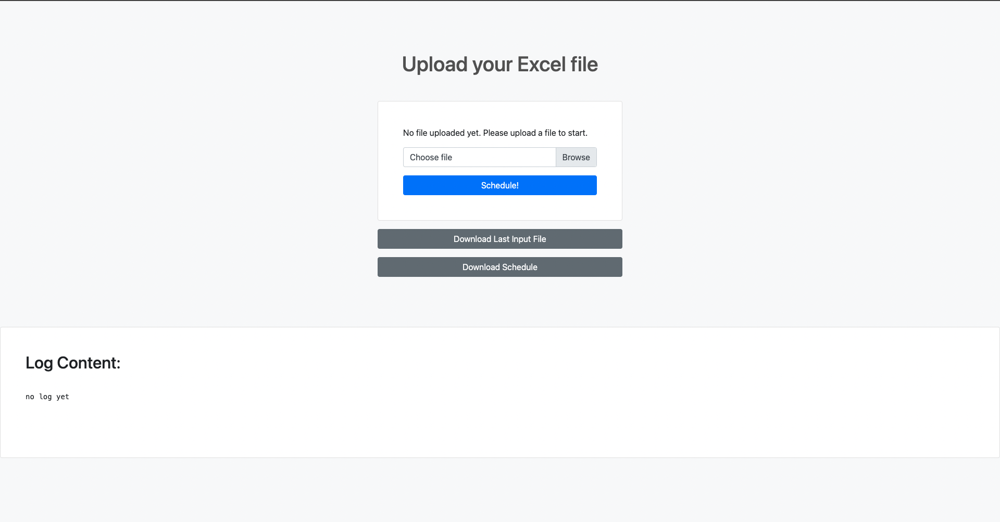

# Course Scheduler

## Introduction

This is a simple course scheduling application built with Flask and pandas. Given the availability of courses and the preferences of each student, the app generates all valid class schedules that fits the preferences of the student. [Code](https://github.com/ryeii/scheduler)

In the ideal case, for a schedule job with $n$ time slots, this app's time complexity is less than $O(n!)$. Click [here](/course_scheduler.pdf) for a simple explanation of the code and see if your job belongs to the ideal case.

## Getting Started

### Prerequisites

- Python 3.10
- pip, the Python package installer

### Clone the Repository

First, clone the repository to your local machine:

```bash
git clone https://github.com/ryeii/scheduler.git
```

### Install Python

The application requires Python 3.10. If you do not have Python 3.10 installed, please visit the [official Python website](https://www.python.org/) and download the appropriate version for your operating system.

### Install Required Python Packages

Navigate to the directory of the cloned repository:

```bash
cd scheduler
```

Then, use pip to install the required packages:

```bash
pip install -r requirements.txt
```

### Run the Application

To run the application, execute the following command in your terminal:

```bash
python app.py
```

The application will start running on your local machine. You can access the application by opening a web browser and navigating to `http://127.0.0.1:5000/`, or the address shown in your console.

## Prepare the Input File

Please checkout this [example](https://github.com/ryeii/scheduler/example_input.xlsx) input file. The input should be a xlsx file consists of two sheets:

- timeslots
- student preferences

please make sure the sheet names are identical as above. 

### Timeslots

The timeslots sheet contains your current schedule of all your classes. 

You may:

- set any number of slots
- change the slot header to anything (for instance, 'slot 1' to 'morning' or 'period 1')
- have uneven length for columns/rows

Please make sure:

- the entries are positioned top-left (no empty row/column before your entries)
- header is always in row 1
- entries start from row 2 downwards
- course names are consistent

Example:


### Student Preferences

The student preferences sheet contains your students' choices

You may:

- change the header to anything
- have missing entries or typos course names
    - missing entries or incorrect course names will fail to schedule, so you can correct them later
- have two students with the same name

Please make sure:

- course names are consistent
- no entry in position A1

Example:


## Usage

Once you have prepared your input document, navigate to the app in your preferred browser and you should see



Click choose file, choose your input file, then click `Schedule!`

The program will start to run as soon as you click the button. Once all students are scheduled, you can see a summary showing the percentage of students successfully scheduled in the Log Content below. You can also download the result schedule by clicking the `Download Schedule` button. A copy of your uploaded file corresponding to the output will also be saved in the app folder, which you can download by `Download Last Input File`.

If you uploaded a file that wasn't in the correct format, you will see a error page. You may go back to the home page, modify your file, and try again.

If you uploaded a file that was accepted, the old input file will be erased.

If there are multiple schedules for one student, the result will contain all possible schedules. The student will have multiple rows in the result file.

Happy Scheduling!