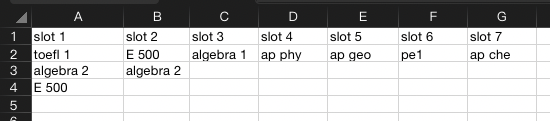
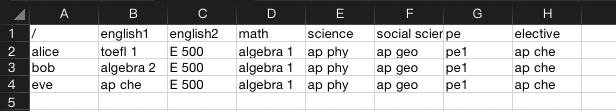

Here is a sample `README.md` file for your project:

# Course Scheduler

## Introduction

This is a simple course scheduling application built with Flask and pandas. Given the availability of courses and the preferences of each student, the app generates all valid class schedules that fits the preferences of the student. [Code](https://github.com/ryeii/scheduler)

## Getting Started

### Prerequisites

- Python 3.10
- pip, the Python package installer

### Clone the Repository

First, clone the repository to your local machine:

```bash
git clone https://github.com/ryeii/scheduler.git
```

### Install Python

The application requires Python 3.10. If you do not have Python 3.10 installed, please visit the [official Python website](https://www.python.org/) and download the appropriate version for your operating system.

### Install Required Python Packages

Navigate to the directory of the cloned repository:

```bash
cd scheduler
```

Then, use pip to install the required packages:

```bash
pip install -r requirements.txt
```

### Run the Application

To run the application, execute the following command in your terminal:

```bash
python app.py
```

The application will start running on your local machine. You can access the application by opening a web browser and navigating to `localhost:5000`.

## Prepare the Input File

Please checkout this [example](https://github.com/ryeii/scheduler/example_input.xlsx) input file. The input should be a xlsx file consists of two sheets:

- timeslots
- student preferences

please make sure the sheet names are identical as above. 

### Timeslots

The timeslots sheet contains your current schedule of all your classes. 

You may:

- set any number of slots
- change the slot header to anything (for instance, 'slot 1' to 'morning' or 'period 1')
- have uneven length for columns/rows

Please make sure:

- the entries are positioned top-left (no empty row/column before your entries)
- header is always in row 1
- entries start from row 2 downwards
- course names are consistent

Example:



### Student Preferences

The student preferences sheet contains your students' choices

You may:

- change the header to anything
- have missing entries or typos course names
    - missing entries or incorrect course names will fail to schedule, so you can correct them later
- have two students with the same name

Please make sure:

- course names are consistent
- no entry in position A1

Example:



Happy Scheduling!
